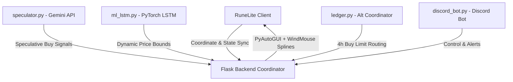

# OSRS GE Quant: The Grand Exchange Bloomberg Terminal 🪙📈

A professional-grade, fully automated quantitative trading, research, and execution suite for the **Old School RuneScape (OSRS)** Grand Exchange.

This repository implements a multi-alt trading desk powered by PyTorch timeseries models, Gemini-driven update sentiment analysis, human-like screen coordinate mouse spline execution, and an interactive Discord control bot.

---

## 🌟 Key Pillars & Architecture



### 1. **Spline-Based Humanoid Click & Type Engine (`automation.py`)**
*   **WindMouse Emulation**: Generates realistic mouse paths using Bezier/Wind splines with natural inertia, gravity forces, wind noise, and overshoot adjustments to defeat macro-detection filters.
*   **Bounding Box Jitter**: Clicks are offset randomly within the actual scanned dimensions of target widgets, avoiding identical repetitive pixel coordinates.
*   **Typing Delays**: Simulates keypress speeds dynamically ($30\text{ ms} - 100\text{ ms}$) with randomized pauses.
*   **Emergency Fail-Safe**: Moving the mouse manually to any corner of the screen triggers `pyautogui.FAILSAFE` to immediately abort automated trade routines.

### 2. **PyTorch LSTM Sequence Timeseries Forecaster (`ml_lstm.py`)**
*   **Sequence-to-Sequence Modeling**: A recurrent deep neural network that processes historical hourly price sequences (24h window).
*   **Relative Return Scaling**: Predicts scale-invariant relative return targets for the next 4 hours ($t+4\text{ hr}$ path) to adapt to items of any price range (from 100 GP to 1.5B GP).
*   **Empirical Envelope Bands**: Reconstructs upper and lower price envelopes ($p_{last} \pm k \cdot \sigma$) using residual standard deviations computed during validation to verify entry and exit limits.

### 3. **Gemini News Speculation Crawler (`speculator.py`)**
*   **Multi-Source Crawler**: Extracts official game updates, voting polls, hotfixes, patch notes, popular **r/2007scape** discussions, and YouTube influencer feeds.
*   **Semantic LLM Mapping**: Leverages the Gemini API with structured JSON schemas to map unstructured blog posts to specific OSRS item keywords.
*   **Expected Move Analysis**: Computes confidence factors and expected move directions (e.g. $+15\%$ expected gain), generating `news` buy recommendations automatically.

### 4. **Multi-Alt Ledger & 4h GE Buy Limit Coordinator (`ledger.py`)**
*   **Consolidated Balance Sheet**: Syncs cash stacks and active holding values across all alts to compute total cash, asset values, and consolidated net worth.
*   **Buy Capacity Routing**: Maintains a sliding 4-hour transaction history ledger per account. Routes newly triggered buy orders to the alt with the most remaining buy limit capacity.

### 5. **Interactive Discord command bot (`discord_bot.py`)**
*   Runs in a concurrent background daemon thread to monitor and manage the trading desk.
*   **Commands Guide**:
    *   `!portfolio`: Renders a rich embed summarizing consolidated net worth, account cash, and active open positions with entry costs and unrealized P&L.
    *   `!status`: Reports bot active status, pause flags, and active RuneLite coordinate widget scan states.
    *   `!pause` / `!resume`: Temporarily suspends or resumes automated click execution.
    *   `!trade [buy/sell] [qty] [price] [item]`: Explicitly queues a manual automated spline-based trade on slot 0.

---

## 💻 CLI Commands Guide

Exposes subcommands using standard Python execution syntax:
```bash
$env:PYTHONPATH="src"
python -m osrs_ge_quant.cli <command> [options]
```

| Command | Description | Key Options |
| :--- | :--- | :--- |
| `init-db` | Initializes the SQLite database schema and seeds initial accounts. | None |
| `refresh-universe` | Refreshes the active GE items universe mapping. | None |
| `update-timeseries` | Fetches and stores timeseries prices for real-time analysis. | `--timestep <5m\|1h>` |
| `backfill-timeseries`| Backfills high-res historical prices to pre-warm LSTM models. | `--timestep <1h>`, `--top-n <int>` |
| `train-model` | Trains Random Forest + LightGBM models on historical flip details. | None |
| `train-lstm` | Trains PyTorch LSTM sequence timeseries forecaster. | None |
| `speculate` | Runs speculation crawl and LLM sentiment analysis. | None |
| `evaluate-sentiment` | Evaluates sentiment forecast accuracies against subsequent prices. | None |
| `run-bot` | Runs Discord Bot daemon standalone. | None |
| `dashboard` | Starts Flask server and background day-trading sentinel thread. | None |

---

## 🛠️ Installation & Booting

### Prerequisites
*   Python 3.10+ (configured via Anaconda environment)
*   JDK 11 (for the sideloaded RuneLite java partner plugin)

### Installation
1.  Clone this repository.
2.  Install dependencies:
    ```bash
    pip install -r requirements.txt
    ```
3.  Configure your `.env` variables:
    ```env
    OPENAI_API_KEY="sk-..."
    GEMINI_API_KEY="AQ..."
    DISCORD_BOT_TOKEN="your-discord-bot-token"
    SMTP_USER="your-email"
    SMTP_PASSWORD="..."
    ```

### Startup
Double-click `run_suite.bat` in the repository root. This script:
1.  Sets up the Python path and points to your Anaconda virtual environment.
2.  Compiles the standalone [quant-plugin](file:///c:/Users/londo/OneDrive/Desktop/quant-plugin) JAR via Maven and copies it to sideloaded directories.
3.  Launches the dashboard server (which auto-boots the background Day-Trading Sentinel and Discord bot daemon threads).
4.  Boots the RuneLite Client in developer mode with the quant partner plugin enabled.
5.  Pops open the dashboard at `http://127.0.0.1:8050` in your web browser.

---

## 🔌 RuneLite Partner Plugin (`quant-plugin`)

The partner plugin located at [quant-plugin/](file:///c:/Users/londo/OneDrive/Desktop/quant-plugin) bridges the client directly to the terminal:
*   **Coordinate Scanning Overlay**: Scans standard Grand Exchange UI components (Group `229`) and the chatbox search bar (Group `162`), relaying absolute screen positions to the Flask app via `/api/runelite/automation-state` endpoints.
*   **Translucent Pink Bounds**: Highlights scanned target bounding boxes to visually confirm correct coordinate alignments.
*   **Automatic Logs**: Sends trade-event payloads instantly upon Grand Exchange transaction completions to keep portfolio ledgers synchronized.


